# 📊 MAPEAMENTO COMPLETO DO BOT WHATSAPP RC LIMPA+

## 📋 Índice
1. [Visão Geral](#visão-geral)
2. [Arquitetura e Integrações](#arquitetura-e-integrações)
3. [Fluxograma Completo](#fluxograma-completo)
4. [Estados e Transições](#estados-e-transições)
5. [Mensagens e Templates](#mensagens-e-templates)
6. [Gatilhos Automáticos](#gatilhos-automáticos)
7. [Análise de Falhas e Melhorias](#análise-de-falhas-e-melhorias)

---

## 1. Visão Geral

### 🎯 Objetivo do Bot
Automatizar o atendimento comercial via WhatsApp para conversão de leads em agendamentos confirmados de serviços de higienização de estofados.

### 📊 Métricas Atuais (Soft Launch)
- **Conversas Iniciadas:** 3,200+
- **Taxa de Conversão:** 25-30% (média)
- **Tempo Médio de Conversão:** 8-12 minutos
- **Taxa de Abandono:** ~15%

### 🏗️ Stack Tecnológica
- **Backend:** Supabase Edge Functions (Deno/TypeScript)
- **IA:** OpenAI GPT-4o (NLP), GPT-4o-mini (texto), Whisper (áudio)
- **WhatsApp API:** Ultramsg (instância: 553194678382)
- **Database:** PostgreSQL (Supabase)
- **CRON:** pg_cron (5 minutos)

---

## 2. Arquitetura e Integrações

### 📡 Edge Functions Principais

#### 1. **receive-whatsapp-bot-webhook** (Núcleo)
- **Rota:** `POST /functions/v1/receive-whatsapp-bot-webhook`
- **Trigger:** Webhook Ultramsg (mensagens recebidas)
- **Responsabilidade:** State machine, processamento NLP, envio de respostas
- **Código:** 2686 linhas (~1800 em state machine)

#### 2. **process-abandoned-carts** (Recuperação)
- **Rota:** `POST /functions/v1/process-abandoned-carts`
- **Trigger:** CRON (a cada 5 minutos)
- **Responsabilidade:** Enviar mensagens de recuperação 2min após abandono
- **Código:** 268 linhas

#### 3. **send-scheduled-reminders** (Pós-venda)
- **Rota:** `POST /functions/v1/send-scheduled-reminders`
- **Trigger:** CRON (a cada 5 minutos)
- **Responsabilidade:** Lembretes (1 dia antes, dia do serviço, pós-venda)
- **Código:** 202 linhas

#### 4. **send-recovery-whatsapp** (Auxiliar)
- **Rota:** `POST /functions/v1/send-recovery-whatsapp`
- **Trigger:** Chamado por process-abandoned-carts
- **Responsabilidade:** Envio individual de mensagem de recuperação
- **Código:** 102 linhas

### 🗄️ Tabelas do Banco de Dados

#### Tabelas Principais
1. **whatsapp_conversas**
   - `id` (UUID)
   - `telefone` (string)
   - `estado_atual` (string) - Estado da máquina
   - `contexto` (JSONB) - Dados da conversa
   - `nome_cliente` (string)
   - `finalizado` (boolean)
   - `criado_em`, `ultima_mensagem` (timestamps)

2. **whatsapp_mensagens**
   - `id` (UUID)
   - `conversa_id` (FK)
   - `direcao` ('entrada' | 'saida')
   - `tipo` ('texto' | 'imagem' | 'audio' | 'transcricao' | 'erro')
   - `conteudo` (text)
   - `imagem_url` (text)
   - `metadata` (JSONB)
   - `criado_em` (timestamp)

3. **agendamentos_bot**
   - `id` (UUID)
   - `conversa_id` (FK)
   - `telefone` (string)
   - `nome_cliente` (string)
   - `itens_selecionados` (JSONB array)
   - `valor_total` (numeric)
   - `cidade`, `cep`, `bairro`, `endereco_completo` (strings)
   - `data_desejada`, `horario_desejado` (date/text)
   - `status` ('orcamento' | 'confirmado' | 'cancelado')
   - `agendamento_id` (FK para agendamentos definitivos)

4. **whatsapp_mensagens_processadas** (Idempotência)
   - `message_id` (string UNIQUE)
   - `telefone` (string)
   - `processado_em` (timestamp)
   - TTL: 24 horas

5. **whatsapp_envios_log** (Auditoria)
   - `conversa_id` (FK)
   - `telefone`, `mensagem`, `status_code`, `sucesso`, `erro_detalhes`, `tentativas`

6. **whatsapp_lembretes** (Pós-venda)
   - `agendamento_id` (FK)
   - `tipo` ('1_dia_antes' | 'dia_do_servico' | 'pos_venda')
   - `agendado_para` (timestamp)
   - `enviado` (boolean)
   - `mensagem` (text)

#### Tabelas de Apoio
7. **servicos** - Catálogo de preços (subcategoria, item, tamanho, preços)
8. **carrinhos_abandonados** - Rastreamento de abandono no site
9. **funcionarios_bot** - Lista de funcionários para envio de boas-vindas

### 🔐 Secrets Necessários
- `OPENAI_API_KEY` (GPT + Whisper)
- `ULTRAMSG_INSTANCE_ID` (553194678382)
- `ULTRAMSG_TOKEN`
- `SUPABASE_URL`
- `SUPABASE_SERVICE_ROLE_KEY`

---

## 3. Fluxograma Completo

```mermaid
graph TD
    A[🚀 Webhook Recebido] --> B{Filtros Críticos}
    B -->|Bot number 553194678382| Z1[❌ Ignorar Loop]
    B -->|Mensagem interna| Z2[❌ Ignorar Typing]
    B -->|ID duplicado| Z3[❌ Idempotência]
    B -->|Válido| C{Conversa Existe?}
    
    C -->|Não| C1[Criar Nova Conversa]
    C1 --> D[Estado: inicial]
    C -->|Sim timeout >24h| C1
    C -->|Sim ativa| C2[Carregar Conversa]
    C2 --> E{Verificar Loop?}
    
    E -->|>10 msgs em 2min| Z4[❌ Finalizar Auto]
    E -->|OK| F{É Atalho /comando?}
    
    F -->|Sim| F1[Processar Atalho]
    F1 --> F2{Qual Comando?}
    F2 -->|/inicio| D
    F2 -->|/ajuda| F3[Listar Comandos]
    F2 -->|/precos| F4[Tabela de Preços]
    F2 -->|/servicos| F5[Lista de Serviços]
    F2 -->|/cancelar| F6[Cancelar Agendamento]
    F2 -->|/status| F7[Status Atual]
    F2 -->|/contato| F8[Info Contato]
    F2 -->|/falar_humano| F9[Transferir Humano]
    F2 -->|/encerrar| F10[Finalizar Conversa]
    F3 --> END1[Enviar + Manter Estado]
    F4 --> END1
    F5 --> END1
    F6 --> END1
    F7 --> END1
    F8 --> END1
    F9 --> END1
    F10 --> END2[Enviar + Finalizar]
    
    F -->|Não| G{Tipo de Mensagem?}
    
    G -->|Áudio| G1[Whisper Transcription]
    G1 --> G2[Converter para Texto]
    G2 --> H
    
    G -->|Imagem| G3[Vision API Analysis]
    G3 --> G4[Detectar Item]
    G4 --> H
    
    G -->|Texto| H{Estado Atual?}
    
    H -->|inicial| I1[Saudação + Atendente]
    I1 --> I2[escolhendo_tipo_servico_global]
    
    H -->|escolhendo_tipo_servico_global| J1{Detectar Tipo}
    J1 -->|Limpeza| J2[Salvar tipo_servico_global]
    J1 -->|Impermeabilização| J2
    J1 -->|Ambos| J2
    J1 -->|Saudação| J3[Responder Educadamente]
    J1 -->|Inválido| J4[Erro + Repetir]
    J2 --> K[verificando_cidade]
    J3 --> J1
    
    H -->|verificando_cidade| K1{Texto Contém?}
    K1 -->|Nome Cidade| K2[Salvar Cidade]
    K1 -->|Nome Item| K3[Transição para identificando_item]
    K1 -->|Inválido| K4[Lista Cidades + Erro]
    K2 --> L[identificando_item]
    K3 --> L
    K4 --> K1
    
    H -->|identificando_item| L1{Detectar Itens}
    L1 -->|Único Item| L2{É Sofá?}
    L1 -->|Múltiplos| L3[Salvar Fila]
    L1 -->|Confirmação Sim| L4[Pegar Primeiro da Fila]
    L1 -->|Nenhum| L5[Erro + Opções]
    
    L2 -->|Sim| M[coletando_modelo_sofa]
    L2 -->|Não| N[coletando_opcao_item]
    L3 --> L6[Perguntar Qual Item]
    L4 --> L2
    L5 --> L1
    
    H -->|coletando_modelo_sofa| M1{Detectar Modelo}
    M1 -->|Válido| M2[Buscar Tamanhos]
    M1 -->|Inválido| M3[Erro + Opções]
    M2 --> M4[Salvar tamanhos_disponiveis]
    M4 --> O[coletando_tamanho_sofa]
    
    H -->|coletando_tamanho_sofa| O1{Detectar Tamanho}
    O1 -->|Válido| O2[Buscar Preço]
    O1 -->|Inválido| O3[Erro + Opções]
    O2 --> P[explicando_servico]
    
    H -->|coletando_opcao_item| N1{Detectar Opção}
    N1 -->|Válida| N2[Buscar Preço]
    N1 -->|Inválida| N3[Erro + Opções]
    N2 --> P
    
    H -->|explicando_servico| P1[Auto-Transição]
    P1 --> P2[Enviar Explicação Serviço]
    P2 --> P3[Aguardar 2s]
    P3 --> Q[apresentando_orcamento]
    
    H -->|apresentando_orcamento| Q1{Cliente Quer?}
    Q1 -->|Mudar/Voltar| Q2[Limpar Contexto]
    Q1 -->|Sim Confirmar| Q3[Adicionar Carrinho]
    Q1 -->|Não| Q4[Voltar Identificar]
    Q2 --> L
    Q3 --> R[perguntando_mais_itens]
    Q4 --> L
    
    H -->|perguntando_mais_itens| R1{Mais Itens?}
    R1 -->|Sim| R2{Fila Tem Mais?}
    R1 -->|Não| R3[Calcular Total]
    R2 -->|Sim| R4[Próximo da Fila]
    R2 -->|Não| R5[Limpar Fila]
    R4 --> L
    R5 --> L
    R3 --> S[informando_pagamento]
    
    H -->|informando_pagamento| S1{Cliente Quer?}
    S1 -->|Adicionar Mais| S2[Voltar Identificar]
    S1 -->|Continuar| T[coletando_nome]
    S2 --> L
    
    H -->|coletando_nome| T1{Nome Válido?}
    T1 -->|Sim| T2[Salvar Nome]
    T1 -->|Não| T3[Erro + Repetir]
    T2 --> U[coletando_telefone]
    T3 --> T1
    
    H -->|coletando_telefone| U1{Telefone Válido?}
    U1 -->|Sim| U2[Salvar Telefone]
    U1 -->|Não| U3[Erro + Repetir]
    U2 --> V[coletando_endereco]
    U3 --> U1
    
    H -->|coletando_endereco| V1{Endereço Válido?}
    V1 -->|Sim| V2[Salvar Endereço]
    V1 -->|Não| V3[Erro + Repetir]
    V2 --> W[coletando_data]
    V3 --> V1
    
    H -->|coletando_data| W1{Data Válida?}
    W1 -->|Sim| W2[Salvar Data]
    W1 -->|Não| W3[Erro + Repetir]
    W2 --> X[coletando_horario]
    W3 --> W1
    
    H -->|coletando_horario| X1{Horário Válido?}
    X1 -->|Sim| X2[Salvar Horário]
    X1 -->|Não| X3[Erro + Repetir]
    X2 --> Y[confirmacao_final]
    X3 --> X1
    
    H -->|confirmacao_final| Y1[Exibir Resumo Completo]
    Y1 --> Y2{Cliente Confirma?}
    Y2 -->|Sim| Y3[Criar Agendamento Definitivo]
    Y2 -->|Não| Y4{Quer Mudar O Que?}
    Y3 --> Y5[Mensagem Sucesso]
    Y5 --> Y6[Finalizar Conversa]
    Y4 -->|Nome| T
    Y4 -->|Telefone| U
    Y4 -->|Endereço| V
    Y4 -->|Data| W
    Y4 -->|Horário| X
    Y4 -->|Itens| L
    Y6 --> END2
    
    H -->|aguardando_imagem| AI1{Imagem Recebida?}
    AI1 -->|Não| AI2[Erro + Repetir]
    AI1 -->|Sim| AI3[Vision Analysis]
    AI3 --> AI4{Confiança >70%?}
    AI4 -->|Sim| AI5[Mapear Item]
    AI4 -->|Não| AI6[Falha + Pedir Descrição]
    AI5 --> AI7[confirmando_item_imagem]
    AI6 --> L
    
    H -->|confirmando_item_imagem| CI1{Cliente Confirma?}
    CI1 -->|Sim| CI2[Usar Análise]
    CI1 -->|Não| CI3[Pedir Descrição]
    CI2 --> L2
    CI3 --> L
    
    Y6 --> PERSIST[Persistir Contexto DB]
    PERSIST --> SEND[Enviar via Ultramsg]
    SEND --> LOG[Log Envio]
    LOG --> END3[✅ Resposta Enviada]
    
    style A fill:#e1f5ff
    style D fill:#fff3cd
    style END2 fill:#d4edda
    style END3 fill:#d4edda
    style Z1 fill:#f8d7da
    style Z2 fill:#f8d7da
    style Z3 fill:#f8d7da
    style Z4 fill:#f8d7da
```



---

## 4. Estados e Transições

### 📍 Estados da Máquina (25 estados)

| Estado | Descrição | Próximos Estados | Validações |
|--------|-----------|------------------|------------|
| **inicial** | Primeira interação | escolhendo_tipo_servico_global | Nenhuma |
| **escolhendo_tipo_servico_global** | Escolher limpeza/impermeabilização/ambos | verificando_cidade | Tipo serviço obrigatório |
| **verificando_cidade** | Validar cidade atendida | identificando_item | Cidade na lista |
| **identificando_item** | Detectar item (sofá, colchão, etc) | coletando_modelo_sofa, coletando_opcao_item, aguardando_imagem | Item reconhecido |
| **coletando_modelo_sofa** | Modelo do sofá (comum, retráril, etc) | coletando_tamanho_sofa | Modelo válido |
| **coletando_tamanho_sofa** | Tamanho do sofá (2-3m, 3-4m, etc) | explicando_servico | Tamanho válido |
| **coletando_opcao_item** | Opções de outros itens | explicando_servico | Opção válida |
| **aguardando_imagem** | Esperando foto do item | confirmando_item_imagem, identificando_item | Imagem recebida |
| **confirmando_item_imagem** | Confirmar análise Vision | coletando_modelo_sofa, coletando_opcao_item | Confirmação sim/não |
| **explicando_servico** | Auto-transição com explicação | apresentando_orcamento | Nenhuma (2s delay) |
| **apresentando_orcamento** | Mostrar preço do item | perguntando_mais_itens, identificando_item | Confirmação sim/não |
| **perguntando_mais_itens** | Adicionar mais itens? | identificando_item, informando_pagamento | Confirmação sim/não |
| **informando_pagamento** | Formas de pagamento | coletando_nome, identificando_item | Confirmação continuar |
| **coletando_nome** | Nome completo do cliente | coletando_telefone | Nome >2 palavras |
| **coletando_telefone** | Telefone de contato | coletando_endereco | Regex phone BR |
| **coletando_endereco** | Endereço completo | coletando_data | Endereço >10 chars |
| **coletando_data** | Data do serviço | coletando_horario | Data futura válida |
| **coletando_horario** | Horário do serviço | confirmacao_final | Horário comercial |
| **confirmacao_final** | Resumo e confirmação final | finalizado, coletando_nome, coletando_telefone, coletando_endereco, coletando_data, coletando_horario, identificando_item | Confirmação sim/não |
| **finalizado** | Conversa encerrada | N/A | N/A |

### 🔄 Fluxos Especiais

#### Fluxo de Loop Infinito (PATCH)
1. Detectar >10 mensagens em 2 minutos
2. Finalizar conversa automaticamente
3. Salvar erro no contexto
4. Retornar status 429

#### Fluxo de Múltiplos Itens
1. Cliente menciona "sofá e colchão"
2. `detectarMultiplosItens()` → ['Sofá', 'Colchão']
3. Salvar em `contexto.fila_itens`
4. Processar primeiro item
5. Após adicionar ao carrinho, perguntar mais itens
6. Se sim, processar próximo da fila
7. Repetir até fila vazia

#### Fluxo de Mudança de Ideia
1. Cliente em `apresentando_orcamento`
2. Diz "espera", "volta", "mudar"
3. Limpar contexto temporário
4. Voltar para `identificando_item`
5. Manter carrinho + agendamento_bot_id

#### Fluxo de Adição Mid-Checkout
1. Cliente em `informando_pagamento`
2. Menciona novo item
3. Detectar item na mensagem
4. Voltar para `identificando_item`
5. Manter carrinho + dados já coletados

---

## 5. Mensagens e Templates

### 📝 Variáveis de Humanização

#### Arrays de Variação
```typescript
// Saudações (rotativas)
SAUDACOES = ["Oi! 👋", "Olá! 😊", "E aí! 👋", ...]

// Confirmações
CONFIRMACOES = ["Anotado! ✅", "Beleza! ✅", "Perfeito! ✅", ...]

// Erros Empáticos
ERROS_EMPATICOS = [
  "Ops, não consegui entender direito 😅",
  "Hmm, acho que não peguei... 🤔",
  ...
]

// Nomes de Atendentes
NOMES_ATENDENTES = ["Renata", "Carla", "Júlia", "Amanda"]
```

#### Saudações Contextualizadas
- **6h-12h:** "Bom dia! ☀️", "Oi, bom dia! 👋"
- **12h-18h:** "Boa tarde! 🌤️", "Oi, boa tarde! 😊"
- **18h-6h:** "Boa noite! 🌙", "Olá, boa noite! 🌙"

### 📨 Mensagens por Estado

#### 1. **inicial**
```
[Saudação por horário]

Aqui é a *Renata* da *RC Limpa Mais*! Vou te ajudar a deixar seus estofados limpinhos e protegidos 🧽✨

Me conta, você precisa de limpeza, impermeabilização ou os dois?
```

#### 2. **escolhendo_tipo_servico_global**
- **Input esperado:** "limpeza", "impermeabilização", "ambos", "os dois"
- **Erro:** "Hmm, não entendi bem 🤔. Você quer limpeza, impermeabilização ou os dois?"

#### 3. **verificando_cidade**
```
Legal! Agora me diz, você é de qual cidade? 📍

A gente atende [lista de cidades]
```
- **Erro (cidade não atendida):**
```
Poxa, ainda não atendemos em [cidade] 😔

Mas a gente tá crescendo! Atendemos em: [lista de cidades]

Você é de alguma dessas?
```

#### 4. **identificando_item**
- **Múltiplos itens detectados:**
```
Opa! Vi que você quer:
✅ Sofá
✅ Colchão
✅ Tapete

Vamos começar pelo Sofá! Qual o modelo dele?
```
- **Item único:**
```
Beleza! E qual o tipo/modelo do [item]?
```
- **Erro:**
```
Hmm, não identifiquei o item 😅

A gente limpa: sofá, colchão, poltrona, tapete, banco automotivo

Qual desses você precisa?
```

#### 5. **coletando_modelo_sofa**
```
Perfeito! Temos esses modelos:

Sofá Comum
Sofá Retráril
Sofá de Canto
Sofá com Chaise
Sofá Cama

Qual desses é o seu?
```

#### 6. **coletando_tamanho_sofa**
```
Anotado! ✅

E qual o tamanho? 📏

Temos: 1.2 a 2.0m, 2.0 a 3.0m, 3.0 a 4.0m, 4.0 a 5.0m, 5.0 a 6.0m
```

#### 7. **explicando_servico**
- **Limpeza:**
```
🧼 *Como funciona a Limpeza:*

Nosso serviço é super prático e feito na sua casa. A gente não só tira aquela sujeira superficial, mas faz uma limpeza de verdade, sabe?

Usamos equipamentos que injetam um produto especial (que mata ácaros e bactérias – ótimo para quem tem alergia!) e, em seguida, sugamos tudo junto com a sujeira.

É por isso que ele fica só úmido e seca rapidinho, geralmente em 4 a 8 horas.

✨ É a melhor forma de deixar seu estofado limpo de verdade, cheiroso e seguro para toda a família!

━━━━━━━━━━━━━━━━

Pronto! Seu orçamento ficou assim:

📦 Sofá Comum (2.0 a 3.0m)
📏 Tamanho: 2.0 a 3.0m
🧼 Serviço: Limpeza

*R$ 150.00*

Bora adicionar no carrinho?
```
- **Impermeabilização:**
```
🛡️ *Impermeabilização Premium*

Chega de medo de manchas! Proteja seu sofá com nossa Impermeabilização Premium.

*Como funciona o serviço?*
Aplicamos um produto de alta tecnologia que cria uma barreira protetora invisível nas fibras do tecido.

Essa barreira faz com que os líquidos sejam repelidos, ou seja, eles não penetram. Se cair café ou vinho, a gota fica "flutuando" na superfície, e você resolve o acidente apenas secando com um papel toalha.

✨ *Resultado:*
Seu estofado fica novo, limpo e protegido por até 1 ano, sem alterar a cor ou toque do tecido.

━━━━━━━━━━━━━━━━
[orçamento...]
```

#### 8. **apresentando_orcamento**
- **Confirmação:**
```
Beleza! ✅

✅ Sofá Comum (2.0 a 3.0m)
🧼 Limpeza - R$ 150.00

Tá no carrinho! 🛒

Quer adicionar mais alguma coisa?
```

#### 9. **informando_pagamento**
```
Aqui tá o resumo do seu pedido:

• Sofá Comum (2.0 a 3.0m)
  🧼 Limpeza
  R$ 150.00

• Colchão Casal
  🧼 Limpeza
  R$ 80.00

💰 Total: R$ 230.00

💳 *Formas de pagamento:*
✅ PIX (5% desconto)
✅ Cartão em até 12x sem juros
✅ Dinheiro (no dia do serviço)

🏦 O pagamento é feito *após* o serviço, quando você ver que ficou perfeito!

Vamos finalizar? Preciso de alguns dados seus 😊
```

#### 10. **coletando_nome**
```
Qual o seu nome completo? 📝
```

#### 11. **coletando_telefone**
```
Perfeito! E qual o seu telefone? 📱

(pode ser com DDD, tipo: 31 99999-9999)
```

#### 12. **coletando_endereco**
```
Show! Agora me passa o endereço completo onde faremos o serviço 📍

(Rua, número, bairro)
```

#### 13. **coletando_data**
```
Beleza! Que dia você prefere? 📅

Pode ser qualquer dia da semana (segunda a sábado)
```

#### 14. **coletando_horario**
```
E que horário fica melhor pra você? ⏰

Nossos técnicos trabalham das 8h às 18h
```

#### 15. **confirmacao_final**
```
✅ *RESUMO DO SEU AGENDAMENTO*

👤 *Cliente:* João Silva
📱 *Telefone:* (31) 99999-9999
📍 *Endereço:* Rua das Flores, 123 - Centro - Belo Horizonte
📅 *Data:* 25/11/2025
⏰ *Horário:* 14h

🛒 *Serviços:*
• Sofá Comum (2.0 a 3.0m) - Limpeza - R$ 150.00
• Colchão Casal - Limpeza - R$ 80.00

💰 *Total: R$ 230.00*

💳 Pagamento após conclusão (PIX, cartão ou dinheiro)

Tá tudo certo? Posso confirmar seu agendamento?
```
- **Sucesso:**
```
🎉 *AGENDAMENTO CONFIRMADO!*

Prontinho! Seu agendamento está confirmado! 🎉

📋 *Código:* #AG123456

📆 Nosso técnico vai chegar dia 25/11/2025 às 14h no endereço informado.

📱 Você receberá lembretes por WhatsApp:
• 1 dia antes do serviço
• No dia do serviço (pela manhã)

💙 Se precisar de qualquer coisa, é só chamar aqui!

*RC Limpa+ - Higienização Profissional* ✨
```

### 🎭 Mensagens de Erro Contextualizadas

#### Erros Genéricos
```typescript
ERROS_EMPATICOS = [
  "Ops, não consegui entender direito 😅 Pode reformular?",
  "Hmm, acho que não peguei... Tenta de novo? 🤔",
  "Desculpa, não entendi muito bem 😬 Pode explicar de outro jeito?",
  "Opa, me perdi aqui 😅 Pode repetir de uma forma diferente?",
  "Xiii, acho que bugou minha cabeça 🤯 Tenta me explicar novamente?"
]
```

#### Erros Específicos por Estado
- **escolhendo_tipo_servico_global:** "Você quer *limpeza*, *impermeabilização* ou *os dois*?"
- **verificando_cidade:** "A gente atende em [lista]. Você é de alguma dessas?"
- **identificando_item:** "A gente limpa: sofá, colchão, poltrona, tapete, banco automotivo. Qual desses?"
- **coletando_telefone:** "Ops, esse número não tá válido 😅. Manda com DDD (ex: 31 99999-9999)"
- **coletando_data:** "Essa data não funciona pra gente 😔. Que tal escolher outra?"

---

## 6. Gatilhos Automáticos

### ⚡ 1. Carrinho Abandonado (Site)

#### Trigger
- **Tabela:** `carrinhos_abandonados`
- **Condições:**
  - `status = 'abandonado'`
  - `tentativas_contato = 0`
  - `telefone IS NOT NULL`
  - `created_at < now() - 2 minutes`
- **CRON:** A cada 5 minutos

#### Mensagem (Abandono no Carrinho)
```
Olá João! 👋

Vi que você estava escolhendo serviços de limpeza mas não finalizou. Posso te ajudar? 😊

🛒 *Seu carrinho:*

🧹 *Limpeza de Estofados*
• Sofá Retráril (3.0 a 4.0m)
  → Quantidade: 1 unidade
  → Valor unitário: R$ 180,00

💰 *Valor total: R$ 180,00*
💳 Pode ser pago no PIX ou em 12x no cartão

📱 Continue por aqui: https://rclimpamais.com.br

Ou me chame que te ajudo! 💬
```

#### Mensagem (Abandono no Agendamento)
```
Olá Maria! 👋

Você estava quase finalizando seu agendamento! Falta pouco para garantir sua data. 😊

📦 *Serviços selecionados:*

🧹 *Limpeza de Estofados*
• Colchão Casal
  → Quantidade: 1 unidade
  → Valor unitário: R$ 80,00

💰 *Valor total: R$ 80,00*
💳 Pode ser pago no PIX ou em 12x no cartão

📍 *Endereço:* Rua das Flores, 123 - Centro
📅 *Data:* 25/11/2025

Continue por aqui: https://rclimpamais.com.br

Estou aqui para ajudar! 💬
```

#### Lógica
1. `process-abandoned-carts` busca carrinhos elegíveis
2. Para cada carrinho, chama `send-recovery-whatsapp`
3. Atualiza `tentativas_contato = 1` e `status = 'contatado'`
4. Registra em `comunicacoes` table

### ⚡ 2. Lembrete 1 Dia Antes

#### Trigger
- **Tabela:** `whatsapp_lembretes`
- **Condições:**
  - `tipo = '1_dia_antes'`
  - `enviado = false`
  - `agendado_para BETWEEN now() AND now() + 5 minutes`
- **CRON:** A cada 5 minutos
- **Criação:** Automática ao confirmar agendamento (agendado_para = data_agendamento - 1 dia às 18h)

#### Mensagem
```
🔔 *Lembrete de Serviço* 🔔

Olá *João Silva*!

Amanhã temos agendado seu serviço de higienização:

📅 *Data:* 25/11/2025
⏰ *Horário:* 14:00
📍 *Local:* Rua das Flores, 123 - Centro - Belo Horizonte
💰 *Valor:* R$ 230.00

✅ Responda *OK* para confirmar sua presença
❌ Responda *CANCELAR* se precisar reagendar

💙 *Equipe RC Limpa+*
```

### ⚡ 3. Lembrete Dia do Serviço

#### Trigger
- **Tabela:** `whatsapp_lembretes`
- **Condições:**
  - `tipo = 'dia_do_servico'`
  - `enviado = false`
  - `agendado_para BETWEEN now() AND now() + 5 minutes`
- **CRON:** A cada 5 minutos
- **Criação:** Automática ao confirmar agendamento (agendado_para = data_agendamento às 08h)

#### Mensagem
```
✨ *Dia do Serviço!* ✨

Bom dia *João Silva*!

Hoje é o dia do seu serviço de higienização:

⏰ *Horário previsto:* 14:00
📍 *Local:* Rua das Flores, 123 - Centro

🚐 Nosso técnico está a caminho!

Em breve você terá seus estofados limpos e higienizados. ✨

💙 *RC Limpa+ - Higienização Profissional*
```

### ⚡ 4. Pesquisa Pós-Venda

#### Trigger
- **Tabela:** `whatsapp_lembretes`
- **Condições:**
  - `tipo = 'pos_venda'`
  - `enviado = false`
  - `agendado_para BETWEEN now() AND now() + 5 minutes`
- **CRON:** A cada 5 minutos
- **Criação:** Automática ao confirmar agendamento (agendado_para = data_agendamento + 1 dia às 14h)

#### Mensagem
```
💙 *Pesquisa de Satisfação* 💙

Olá *João Silva*!

Como foi sua experiência com nosso serviço de higienização?

⭐️ *De 0 a 10, qual nota você daria?*

Seu feedback é muito importante para nós! 😊

📸 Se possível, envie fotos do resultado!

🎁 E não esqueça: você tem *20% de desconto* na próxima contratação!

💙 *Equipe RC Limpa+*
📞 Entre em contato se precisar de qualquer coisa!
```

### ⚡ 5. Boas-vindas Funcionário Bot

#### Trigger
- **Ação Manual:** Admin adiciona funcionário na tabela `funcionarios_bot`
- **Edge Function:** `send-welcome-bot` (chamada manualmente via UI)

#### Mensagem
```
👋 Olá {{nome}}!

Seja bem-vindo(a) à equipe RC Limpa+! 🎉

Estamos muito felizes em ter você conosco. Aqui está tudo que você precisa saber para começar:

📋 *Informações Importantes:*
• Seu acesso ao sistema já foi criado
• Você receberá notificações de novos agendamentos
• Em caso de dúvida, entre em contato com a administração

💙 *Vamos juntos fazer a diferença!*

*Equipe RC Limpa+*
```

### ⚡ 6. Detecção de Loop Infinito

#### Trigger
- **Tempo Real:** Durante processamento de mensagem
- **Condição:** >10 mensagens em 2 minutos na mesma conversa
- **Ação:** Finalizar conversa automaticamente

#### Mensagem (NÃO enviada ao cliente)
- Bot simplesmente para de responder
- Log interno: "Loop infinito detectado, conversa finalizada"
- `contexto.erro = 'Loop infinito detectado automaticamente'`

### ⚡ 7. Contador de Erros Consecutivos

#### Trigger
- **Estado:** Qualquer estado após 3 erros consecutivos
- **Ação:** Escalar para atendimento humano

#### Mensagem
```
😕 Percebo que está com dificuldade...

✋ Vou transferir você para um atendente humano que pode te ajudar melhor!

⏱️ Um momento, por favor...
```

---

## 7. Análise de Falhas e Melhorias

### 🔴 Problemas Críticos Identificados

#### 1. **Loop Infinito (RESOLVIDO)**
- **Causa:** Bot processava suas próprias mensagens
- **Impacto:** 99.5% das conversas presas (3,200+)
- **Correção:** Filtro anti-loop com número normalizado (12 dígitos)
- **Status:** ✅ Implementado (Correção #16)

#### 2. **Context Loss em Transições**
- **Causa:** `tamanhos_disponiveis` não persistido ao mudar estado
- **Impacto:** Falha na detecção de tamanho de sofá
- **Correção:** Persistir explicitamente antes de transição
- **Status:** ✅ Implementado (Correção #9)

#### 3. **Capitalização Inconsistente**
- **Causa:** `detectarSubcategoria()` retorna "SOFÁ", mas DB tem "Sofá"
- **Impacto:** Matching falha, loop "não entendi"
- **Correção:** Normalização Capital Case em todas funções
- **Status:** ✅ Implementado (Correção #17-#18)

#### 4. **Idempotência Ausente**
- **Causa:** Mensagens duplicadas processadas 2x
- **Impacto:** Custos dobrados OpenAI, estado avançado 2x
- **Correção:** Tabela `whatsapp_mensagens_processadas` com TTL 24h
- **Status:** ✅ Implementado (Correção #23)

#### 5. **Mensagem Vazia em `explicando_servico`**
- **Causa:** Estado retornava `mensagem: ''` esperando próximo estado gerar
- **Impacto:** Cliente recebia mensagem vazia
- **Correção:** Retornar explicação + orçamento sincronizados
- **Status:** ✅ Implementado (Correção #1)

### 🟡 Problemas Médios

#### 6. **Horário Comercial Desativado**
- **Causa:** `process-abandoned-carts` tem checks comentados
- **Impacto:** Mensagens enviadas 24/7 (inclusive domingos às 3h)
- **Correção:** Reativar validações antes de produção
- **Status:** ⚠️ Pendente (modo teste ativo)

#### 7. **Ausência de Rate Limiting no Bot**
- **Causa:** Nenhum controle de taxa de mensagens por usuário
- **Impacto:** Usuário pode spammar e causar loop
- **Correção:** Implementar throttle 1 msg/segundo por usuário
- **Status:** ❌ Não implementado

#### 8. **Falta de Retry em Ultramsg**
- **Causa:** Se Ultramsg falha, mensagem é perdida
- **Impacto:** Cliente não recebe resposta (silent fail)
- **Correção:** Queue de retry com backoff exponencial
- **Status:** ❌ Não implementado (soft-fail atual)

#### 9. **Análise de Imagem com Baixa Confiança**
- **Causa:** Vision API retorna confiança <70% e bot falha
- **Impacto:** Cliente tem que digitar mesmo enviando foto
- **Correção:** Implementar fallback para análise manual
- **Status:** ⚠️ Parcialmente implementado

### 🟢 Melhorias Sugeridas

#### 10. **Dashboard de Monitoramento Real-Time**
- **Objetivo:** Ver conversas ativas, loops, taxa de conversão ao vivo
- **Tecnologia:** WebSocket + React
- **Prioridade:** P1 (Alta)
- **Esforço:** 40h

#### 11. **A/B Testing de Mensagens**
- **Objetivo:** Testar variações de mensagens para otimizar conversão
- **Tecnologia:** Feature flags + analytics
- **Prioridade:** P2 (Média)
- **Esforço:** 20h

#### 12. **Follow-up Sequence para Carrinhos**
- **Objetivo:** Enviar 2ª e 3ª mensagens se cliente não responde
- **Tecnologia:** CRON schedule adicional
- **Prioridade:** P1 (Alta)
- **Esforço:** 8h

#### 13. **Inteligência para Detectar Frustração**
- **Objetivo:** Escalar para humano se cliente demonstra frustração
- **Tecnologia:** Análise de sentimento (OpenAI)
- **Prioridade:** P2 (Média)
- **Esforço:** 16h

#### 14. **Cache de Respostas Comuns**
- **Objetivo:** Reduzir custos OpenAI com cache de perguntas frequentes
- **Tecnologia:** Redis + hashing
- **Prioridade:** P3 (Baixa)
- **Esforço:** 12h

#### 15. **Multi-idioma (Inglês/Espanhol)**
- **Objetivo:** Atender clientes estrangeiros
- **Tecnologia:** i18n + OpenAI translation
- **Prioridade:** P3 (Baixa)
- **Esforço:** 24h

### 📊 Métricas a Monitorar

#### KPIs de Conversão
- Taxa de conversão (conversas → agendamentos confirmados): **Target 30%**
- Tempo médio de conversão: **Target <10 min**
- Taxa de abandono: **Target <10%**
- Taxa de loop: **Target 0%**

#### KPIs Técnicos
- Uptime Ultramsg: **Target 99.5%**
- Latência média de resposta: **Target <2s**
- Taxa de erro OpenAI: **Target <1%**
- Taxa de reprocessamento (idempotência): **Target <0.1%**

#### KPIs Financeiros
- Custo por conversa (OpenAI): **Target <R$ 0.50**
- Custo por agendamento convertido: **Target <R$ 2.00**
- ROI (receita gerada / custo bot): **Target >20x**

---

## 📈 Roadmap de Melhorias

### Sprint 1 (Semana 1-2) - CRÍTICO
- [x] Correção #1-#23 (Loop, Context Loss, Capitalização)
- [x] Idempotência completa
- [ ] Reativar horário comercial
- [ ] Dashboard de monitoramento básico
- [ ] Alertas de loop/erro por email

### Sprint 2 (Semana 3-4) - ALTO
- [ ] Follow-up sequence (2ª e 3ª mensagens)
- [ ] Rate limiting por usuário
- [ ] Retry queue Ultramsg
- [ ] Logs estruturados (JSON)
- [ ] Testes E2E automatizados

### Sprint 3 (Semana 5-6) - MÉDIO
- [ ] A/B testing framework
- [ ] Análise de sentimento
- [ ] Cache de respostas
- [ ] Otimização de custos OpenAI
- [ ] Relatório semanal automático

### Sprint 4 (Semana 7+) - BAIXO
- [ ] Multi-idioma
- [ ] Integração com CRM externo
- [ ] Voice bot (Whisper + TTS)
- [ ] Chatbot web (não WhatsApp)

---

## 🎓 Documentação Técnica Adicional

### Comandos Úteis

#### SQL Queries de Diagnóstico
```sql
-- Ver conversas ativas
SELECT id, telefone, estado_atual, created_at, ultima_mensagem
FROM whatsapp_conversas
WHERE finalizado = false
ORDER BY ultima_mensagem DESC
LIMIT 50;

-- Detectar loops
SELECT conversa_id, COUNT(*) as total_msgs
FROM whatsapp_mensagens
WHERE criado_em > NOW() - INTERVAL '10 minutes'
GROUP BY conversa_id
HAVING COUNT(*) > 10
ORDER BY total_msgs DESC;

-- Taxa de conversão
SELECT 
  COUNT(DISTINCT c.id) as total_conversas,
  COUNT(DISTINCT ab.id) FILTER (WHERE ab.status = 'confirmado') as confirmados,
  ROUND(100.0 * COUNT(DISTINCT ab.id) FILTER (WHERE ab.status = 'confirmado') / COUNT(DISTINCT c.id), 2) as taxa_conversao
FROM whatsapp_conversas c
LEFT JOIN agendamentos_bot ab ON ab.conversa_id = c.id
WHERE c.criado_em > NOW() - INTERVAL '7 days';

-- Mensagens com erro Ultramsg
SELECT *
FROM whatsapp_envios_log
WHERE sucesso = false
ORDER BY created_at DESC
LIMIT 50;
```

#### Curl para Testar Edge Functions
```bash
# Testar bot webhook manualmente
curl -X POST 'https://yyrnshankehiqvkndrwk.supabase.co/functions/v1/receive-whatsapp-bot-webhook' \
  -H 'Authorization: Bearer [ANON_KEY]' \
  -H 'Content-Type: application/json' \
  -d '{
    "from": "5531999999999",
    "type": "text",
    "body": "oi"
  }'

# Testar process-abandoned-carts
curl -X POST 'https://yyrnshankehiqvkndrwk.supabase.co/functions/v1/process-abandoned-carts' \
  -H 'Authorization: Bearer [SERVICE_ROLE_KEY]' \
  -H 'Content-Type: application/json'
```

### Configuração Ultramsg
1. Acessar: https://ultramsg.com/dashboard
2. Instância: 553194678382
3. Webhook URL: `https://yyrnshankehiqvkndrwk.supabase.co/functions/v1/receive-whatsapp-bot-webhook`
4. Eventos ativados: `messages.upsert`
5. Configuração: Ignorar mensagens de saída (prevent loop)

---

## 📞 Contatos e Suporte

### Equipe Responsável
- **Desenvolvedor Backend:** RC Limpa+ Dev Team
- **Product Owner:** Administração RC Limpa+
- **Suporte Técnico:** Via WhatsApp (31) 99999-9999

### Links Úteis
- **Projeto Supabase:** https://supabase.com/dashboard/project/yyrnshankehiqvkndrwk
- **Ultramsg Dashboard:** https://ultramsg.com/dashboard
- **OpenAI Usage:** https://platform.openai.com/usage
- **Repositório:** (privado)

---

**Última Atualização:** 25/11/2025
**Versão do Bot:** 1.8.0 (16 correções críticas implementadas)
**Status:** ✅ Produção (Soft Launch)
